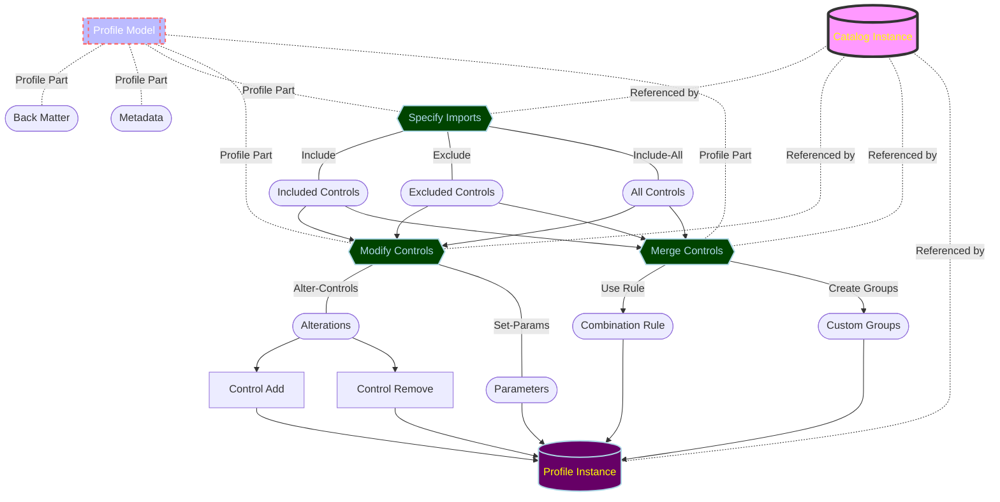
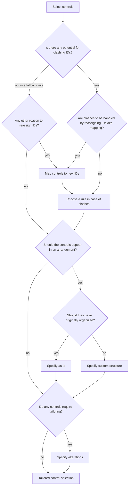
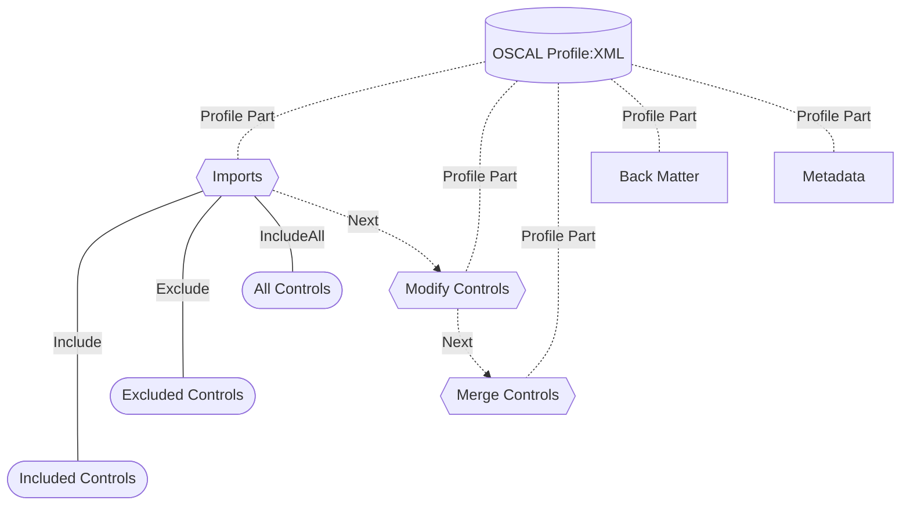
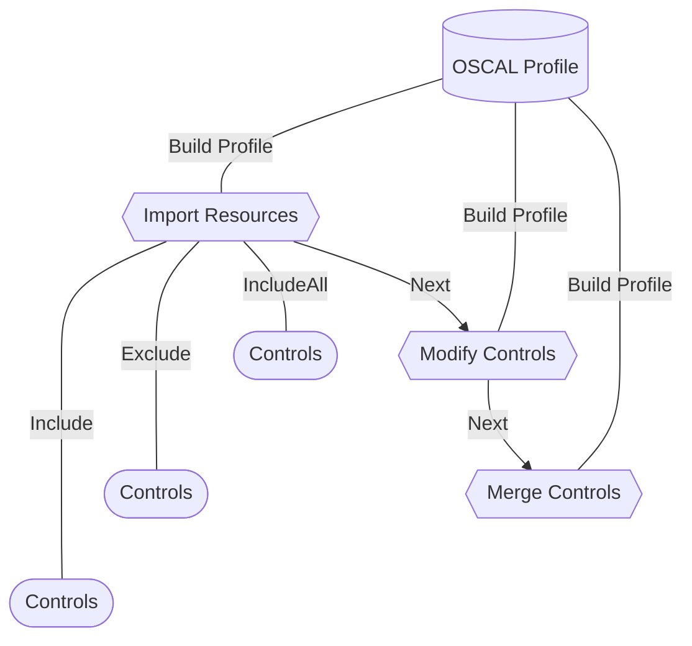
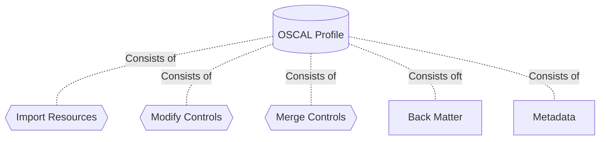
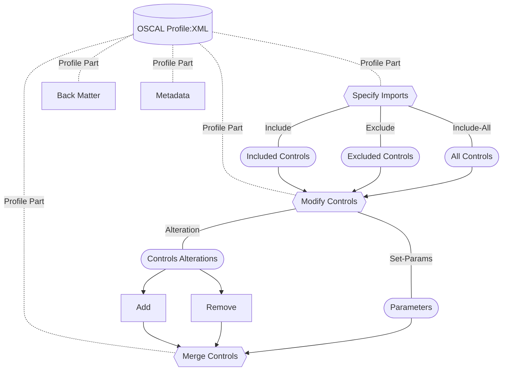

```mermaid


graph TD
    OP[[Profile Model]]:::typ -.-     |Profile Part| BM([Back Matter])
    OP -.- |Profile Part| MD([Metadata])
    OP -.- |Profile Part| IMP{{Specify Imports}}:::act
    OP -.- |Profile Part| MDF{{Modify Controls}}:::act
    OP -.- |Profile Part| MRG{{Merge Controls}}:::act

    OC[(Catalog Instance)]:::cat -.- |Referenced by| IMP
    IMP --- |Include| CI([Included Controls]) --> MDF
    IMP --- |Exclude| CX([Excluded Controls]) --> MDF
    IMP --- |Include-All| CT([All Controls]) --> MDF


    MDF --- |Alter-Controls| ALT([Alterations])
    ALT --> ADD[Control Add] --> FP[(Profile Instance)]:::cat
    ALT --> RMV[Control Remove] --> FP
    MDF --- |Set-Params| STP([Parameters]) --> FP

    CI --> MRG
    CX --> MRG
    CT --> MRG
    MRG --> |Use Rule| CR([Combination Rule]) --> FP
    MRG --> |Create Groups| CG([Custom Groups]) --> FP


    OC -.- |Referenced by| MDF
    OC -.- |Referenced by| MRG
    OC -.- |Referenced by| FP

    style OC fill:#f9f,stroke:#333,stroke-width:4px
    style OP fill:#bbf, stroke:#f66, stroke-width:2px, color:#fff, text-color:#000,stroke-dasharray: 5 5

    classDef cat fill:#660066, color:yellow, stroke:lightblue, stroke-width:2px, font-size: 16px
    classDef act fill:#004400, color:lightblue, stroke:lightblue, stroke-width:2px
    classDef typ fill:#000099, color:yellow, stroke:lightblue, stroke-width:2px
```

```mermaid
graph TB
  select[Select controls] --> Qmerge{Is there any potential for clashing IDs?}
  Qmerge --> |yes| Qclashes{Are clashes to be handled by reassigning IDs aka mapping?}
  Qmerge --> |no: use fallback rule| Qmapanyway{Any other reason to reassign IDs?}
  Qmapanyway --> |yes|mapcontrols
  Qmapanyway --> |no|Qarrange{Should the controls appear in an arrangement?}
  merge --> Qarrange
  Qclashes --> |yes| mapcontrols[Map controls to new IDs]
  mapcontrols --> merge
  Qclashes--> |no| merge[Choose a rule in case of clashes]

  Qarrange --> |yes| Qas-is{Should they be as originally organized?}
  Qarrange --> |no| Qchange
  Qas-is --> |yes| asis[Specify as-is]
  asis --> Qchange
  Qas-is --> |no| custom[Specify custom structure]
  custom --> Qchange{Do any controls require tailoring?}
  Qchange -->|no| baseline[Tailored control selection]
  Qchange -->|yes| alter[Specify alterations]
  alter --> baseline
```

```mermaid
graph TD
    OP[(OSCAL Profile:XML)] -.- |Profile Part| IMP{{Imports}}
    OP -.- |Profile Part| MDF{{Modify Controls}}
    OP -.- |Profile Part| MRG{{Merge Controls}}
    OP -.- |Profile Part| BM[Back Matter]
    OP -.- |Profile Part| MD[Metadata]

    IMP ----- |Include| CI([Included Controls])
    IMP ---- |Exclude| CX([Excluded Controls])
    IMP --- |IncludeAll| CT([All Controls])

    IMP -.-> |Next| MDF
    MDF -.-> |Next| MRG
```

```mermaid

graph TD
    OP[(OSCAL Profile)] --- |Build Profile| IMP{{Import Resources}}
    OP --- |Build Profile| MDF{{Modify Controls}}
    OP --- |Build Profile| MRG{{Merge Controls}}
    IMP ----- |Include| C1([Controls])
    IMP ---- |Exclude| C2([Controls])
    IMP --- |IncludeAll| C3([Controls])
    IMP --> |Next| MDF
    MDF --> |Next| MRG
```

```mermaid
graph TD
    OP[(OSCAL Profile)] -.- |Consists of| IMP{{Import Resources}}
    OP -.- |Consists of| MDF{{Modify Controls}}
    OP -.- |Consists of| MRG{{Merge Controls}}
    OP -.- |Consists oft| BM[Back Matter]
    OP -.- |Consists of| MD[Metadata]

```

```mermaid
graph TD
    OP[(OSCAL Profile:XML)] -.- |Profile Part| IMP{{Specify Imports}}
    OP -.- |Profile Part| MDF{{Modify Controls}}
    OP -.- |Profile Part| MRG{{Merge Controls}}
    OP -.- |Profile Part| BM[Back Matter]
    OP -.- |Profile Part| MD[Metadata]

    IMP --- |Include| CI([Included Controls]) --> MDF
    IMP --- |Exclude| CX([Excluded Controls]) --> MDF
    IMP --- |Include-All| CT([All Controls]) --> MDF

    MDF --- |Alteration| ALT([Controls Alterations])
    ALT --> ADD[Add] --> MRG
    ALT --> RMV[Remove] --> MRG
    MDF --- |Set-Params| STP([Parameters]) --> MRG
```
